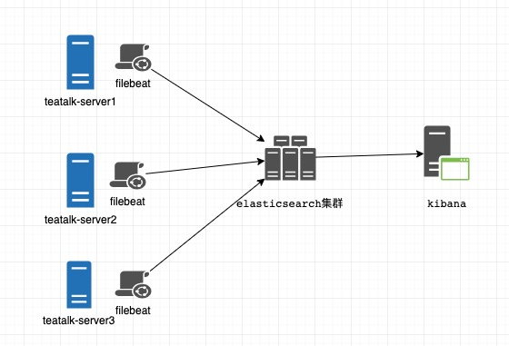

#### 1.系统结构与介绍

系统结构：

功能环境地址：

    elasticsearch(日志存储):
    filebeat(日志收集工具):10.10.220.90
    kibana(日志展示): http://10.10.208.193:5601/app/kibana#?_g=()

##### 1.1建议

    功能环境测试
    elasticsearch 采用docker安装
    filebeat 资源文件安装
    kibana 采用docker安装
    
    生产环境
    elasticsearch 资源文件安装
    filebeat 资源文件安装
    kibana 采用docker安装
    
#### 2.elasticsearch安装配置
[elasticsearch参考文件](elasticsearch)

##### 2.1.docker安装
    docker pull docker.elastic.co/elasticsearch/elasticsearch:6.0.0
    
    docker run -d --elasticsearch es \
    -p 9200:9200 -p 9300:9300 \
    -e "discovery.type=single-node" docker.elastic.co/elasticsearch/elasticsearch:6.0.0

##### 2.1.其他安装
[elasticsearch安装tar.gz安装](../elasticsearch/elasticsearch安装.md)

#### 3.filebeat安装配置
[filebeat参考文件-filebeat](filebeat)
    更多资源也可在网上搜索
    
[官网](https://www.elastic.co/cn/products/beats/filebeat)

##### 3.1.安装
[下载地址](https://www.elastic.co/downloads/beats/filebeat)
    
    cd /home
    mkdir elk
    cd elk
    wget https://artifacts.elastic.co/downloads/beats/filebeat/filebeat-7.0.0-linux-x86_64.tar.gz
    tar -xzvf filebeat-6.6.2-linux-x86_64.tar.gz 
        
##### 3.2.配置文件
[配置示例文件-filebeat.yml](filebeat.yml)

    文件位置
    /home/elk/filebeat-7.0.0-linux-x86_64
    
###### 3.2.1.配置监听文件及过滤规则
    
      paths:
        - /home/dev/innerapp/dtc/nohup.out
    #    - /home/dev/innerapp/msc/nohup.out
        - /home/dev/innerapp/conc/nohup.out
        
      multiline.pattern: '^((((1[6-9]|[2-9]\d)\d{2})-(0?[13578]|1[02])-(0?[1-9]|[12]\d|3[01]))|(((1[6-9]|[2-9]\d)\d{2})-(0?[13456789]|1[012])-(0?[1-9]|[12]\d|30))|(((1[6-9]|[2-9]\d)\d{2})-0?2-(0?[1-9]|1\d|2[0-8]))|(((1[6-9]|[2-9]\d)(0[48]|[2468][048]|[13579][26])|((16|[2468][048]|[3579][26])00))-0?2-29)) (20|21|22|23|[0-1]?\d):[0-5]?\d:[0-5]?\d'
      multiline.negate: true
      multiline.match: after
###### 3.2.1.配置输出到es    
    output.elasticsearch:
      # Array of hosts to connect to.
      hosts: ["10.10.208.193:9200"]
      index: "teatalk-%{+yyyy.MM.dd}"
    ##索引字段
    setup.template.name: "teatalk"
    setup.template.pattern: "teatalk-*"

##### 3.3.启动

    nohup ./filebeat -e -c filebeat.yml > filebeat.log &
    
##### 3.4.现有运行地址

    10.10.220.90

#### 4.kibana安装配置
[kibana参考文件](kibana)

##### 4.1.docker安装

    docker pull elastic/kibana:6.0.0
    docker run --name kibana6.0.0 -e ELASTICSEARCH_URL=http://10.10.208.194:9200 -p 5601:5601 -d 2f0aebda029e
    
    2f0aebda029e为拉取的镜像id

 